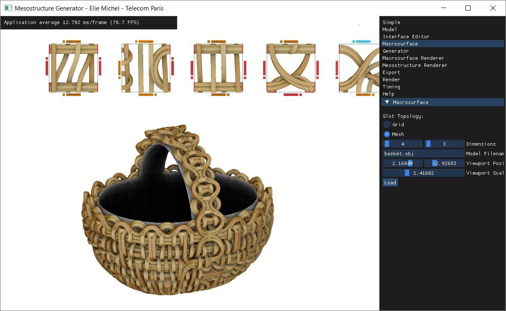

MesoGen
=======

*The official implementation of [MesoGen: Designing Procedural On-Surface Stranded Mesostructures](https://eliemichel.github.io/MesoGen) (SIGGRAPH 2023).*



Table of Contents
-----------------

 - [What is this?](#what-is-this)
 - [Usage](#usage)
   + [Download](#download)
   + [Instructions](#instructions)
 - [Building from source](#building-from-source)
   + [Download sources](#download-source)
   + [Dependencies](#dependencies)
   + [Building](#building)
   + [Running](#running)
   + [Sharing](#sharing)
 - [License](#license)

What is this?
-------------

This is a research prototype, meant to demonstrate the ideas presented in the paper [*MesoGen*](https://eliemichel.github.io/MesoGen) and provide a reference implementation to compare others with.

It is important to note that it is not meant to be full featured production tool, so the user experience could be better. It is rather a tool used internally while developing the paper to iterate on ideas and compare various options.

Nevertheless, it is usable as it is, and we are open to adding new features meant to make its use easier by non-technicians.

The overall workflow of MesoGen is:

 1. Create a coarse mesh along which the mesostructure will be generated. This is called the **macrosurface**, and it must only contain quads. (You may use [Instant Meshes](https://github.com/wjakob/instant-meshes) for instance to get a quad mesh out of an arbitrary one).

 2. Define a **set of tiles** used as building blocks to generate the mesostructure. A tile has 4 sides, each of which is assigned an **interface**. When two sides of the same or different tiles are assigned the same interface, they are always **simultaneously edited**. Interface also define which tile is allowed to be placed next to which other ones.

 3. The **geometric content** of tiles is defined by first drawing 2D cross-sections on interfaces, then bridging them with a sweep surface by selecting the lines that connect them.

 4. Whenever the tile set feels ready, one can **generate** the **mesostructure** by calling an automatic tiling solver. This solver may or may not find a solution. If it does not, it can suggest a new tile to add to the tile set.

 5. You can go further by playing in real time with the **global scale** of cross-sections, the **thickness** of the **shell** in which the mesostructure is generated, etc. You can also flag some interfaces as being forbidden or on the contrary only allowed upon **open edges of the base macrosurface mesh**.

Usage
-----

### Download

Precompiled binaries are only available for Windows, see the [last release](https://github.com/eliemichel/MesoGen/releases/latest). On any other OS, you need to build from source.

**NB** If you happen to create a build for another OS, you are welcome to share it with us so that we can add it to the release downloads!

### Instructions

Start by running the `MesostructureGenerator.exe` program. It should open a window similar to the screenshot above, except empty.

#### UI

The first lines of the right-hand side bar are sections: `Simple`, `Model`, etc. Click on them to navigate the different parts of the configuration.

**NB** *If the UI is too small, jump to the `Help` section and increase the first value in there.*

The `Simple` section provides quick access to inputs that are also present in other sections, ordered in a typical workflow sequence. Besides this, each element is only present in one section.

The `Scene` input is a json file that contains a value for all other inputs of the UI. It is used to save the state of the app.

The `Model` input is a json file that describes the set of tiles used as building blocks to generate the mesostructure. Its content is detailed in the `Model` section.

The `Macrosurface` is a standard OBJ file. This prototype uses a non-standard convention for the axes though, so when exporting from Blender make sure to set the axis system as Z up and -Y forward. More option can be set up in the `Macrosurface` section.

The `Generator` button calls the automatic tiling solver. More option can be set up in the `Generator` section.

The `Macrosurface Renderer` and `Mesostructure Renderer` options tune how the macrosurface and mesostructure are rendered. Again, the similarly named section provide more options.

The `Interface Editor` enables you to tune the tool that draws 2D cross-sections on interfaces.

#### Camera Controls

 - **Left-Mouse Button** orbits around the tiles.
 - **Right-Mouse Button** and **Mouse Wheel** both control the zoom.
 - **Middle-Mouse Button** and **Alt + Left-Mouse Button** pan in the view.
 - **Shift + Left-Mouse Button** orbits around the macrosurface/mesosurface.
 - **C** displays the camera matrices in the terminal.
 - **P** toggles the right-hand panel.
 - **F5** reloads shaders from disk.

Building from source
--------------------

### Download source

You can either use the [Download](https://github.com/eliemichel/MesoGen/archive/refs/heads/main.zip) button or use `git` to get the source code:

```
git clone https://github.com/eliemichel/MesoGen.git
cd MesoGen
```

### Dependencies

This projects includes most of its batteries, all you need besides the source code is:

 - [CMake](https://cmake.org/) for configuration.
 - [Python](https://www.python.org/) to generate glad headers.
 - The `xorg-dev` package if on linux (this is the Debian name of the package, something similar exists for other distributions).

**NB** In theory the build should work on either Windows, macOS and linux, although it's been mostly tested on Windows so some minor compiler-specific fixes may be needed.

### Building

This is a standard CMake project. Building it consits in running:

```bash
# Configure (create a 'build/' directory)
cmake -B build

# Build (create the executables)
cmake --build build --config Release
```

You can chose which compiler to use in the first call to `cmake`, using the `-G` option. See for instance [`build-msvc16.bat`](build-msvc16.bat) to build for Visual Studio 15 (2017), or the other build files for `mingw` or `gcc`. More easily, you can also just run one of those scripts, it will even get git submodules.

**NB** It is recommended to build in **Release mode** because the tiling library is slow in debug mode.

### Running

The executable file is created within the `build` directory, in `src/MesostructureGenerator` or `src/MesostructureGenerator/Debug` or `src/MesostructureGenerator/Release` or something similar depending on your compiler.

**NB** Run from the `share/samples` directory in order to easily load example scenes (using default values in the UI).

### Sharing

**By default**, the build is configured in **development mode**, which has the path to shaders be hardcoded in order to enable easy reload from source tree (by hitting F5).

This is nice **except when you wen to share the build with other people**. When so, turn the dev mode off upon using CMake:

```
cmake -B build-shared -DDEV_MODE=OFF
```

Make sure to copy the `share/` directory in the release zip, next to `MesostructureGenerator.exe`. You may also copy the content of the `share/samples` directory to enable easy loading from the default values.

License
-------

This repository as a whole is shared under the terms of the MIT license. For more information, see [`LICENSE`](LICENSE). It includes dependencies that are individually licensed under similar licenses, see each directory's LICENSE file.
